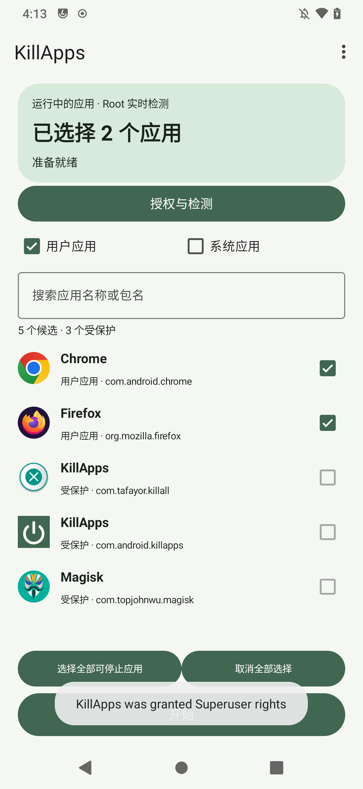
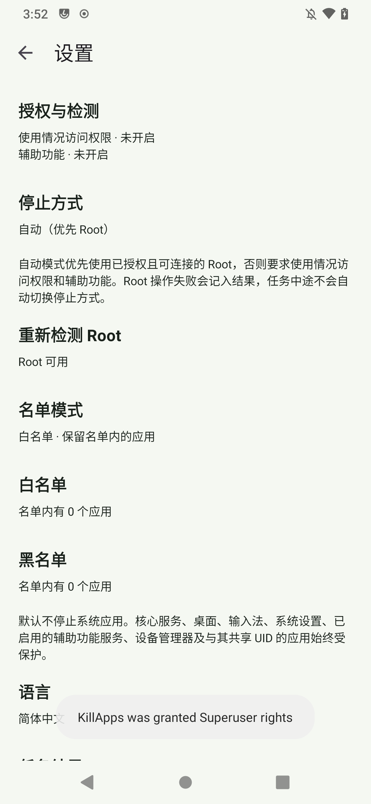

<p align="center">
  
</p>

# KillApps

[](https://github.com/celeron633/KillApps/actions/workflows/build.yml)

**Android 8.0+ · Material Design 3 · 中文 / English · Apache License 2.0**

[简体中文](#简体中文) | [English](#english) | [界面预览 / Screenshots](#screenshots)

<a id="screenshots"></a>

## 界面预览 / Screenshots

| 应用列表 / App list | 设置 / Settings |
| :---: | :---: |
|  |  |

## 简体中文

KillApps 是一款支持 **Android 8.0 及以上**的开源应用管理工具。通过 Root 或辅助功能批量停止应用，提供用户／系统应用筛选、黑白名单和逐项处理结果。

### 功能

- **Root 优先**：自动模式优先使用已授权的 Root；也可选择仅 Root 或仅辅助功能。
- **辅助功能停止**：无 Root 时，依次打开系统应用详情并操作“强行停止”及确认按钮。
- **可控的应用筛选**：按名称或包名搜索，筛选用户／系统应用，勾选本次需要停止的应用。
- **独立黑白名单**：白名单保留指定应用；黑名单模式只停止名单中的应用。两份名单分别保存。
- **任务进度与结果**：开始前重新检测，支持取消剩余队列，显示成功、失败及跳过数量。
- **MD3 界面**：支持系统明暗主题、中文与英文，以及跟随系统语言。
- **本机运行**：无广告、无统计、无网络权限；名单与设置保存在设备上。

默认只筛选用户应用，并自动保护自身、桌面、输入法及已启用的辅助功能服务等关键应用。

### 使用方式

1. 首次启动按提示授权：Root 可用时可直接使用；无 Root 时需要使用情况访问权限和辅助功能。
2. 在右上角设置中选择停止方式、名单模式，并编辑需要保留或停止的应用名单。
3. 在首页筛选、勾选应用，点击“开始”，确认后逐个停止。
4. 查看任务结果；运行期间可取消尚未处理的应用，辅助功能模式下也可通过浮条取消。

无 Root 时，列表根据最近 24 小时的活动生成候选，**不等于完整的运行进程列表**。强行停止可能中断应用通知和后台任务，直到再次打开应用。辅助功能已适配中英系统文案，其他厂商 ROM 的设置页面需要额外验证。任务结果保存在当前进程内，重启进程后清空。

### 构建与安装

直接下载安装包请前往 [GitHub Releases](https://github.com/celeron633/KillApps/releases/latest)。提供 **arm32、arm64、universal** 三种包，不确定设备架构时选择 universal。当前版本使用测试证书签署 Release 构建，安装前请查看 Release 页的签名说明。

使用 Android Studio 打开项目，选择 **JDK 17** 并安装 **Android SDK 35**。项目使用 AGP 8.7.3 和 Gradle 8.9，已包含 Gradle Wrapper；`local.properties` 指向本机 SDK。

在 Windows PowerShell 中执行：

```powershell
./gradlew.bat :app:assembleDebug :app:testDebugUnitTest :app:lintDebug
adb install -r app/build/outputs/apk/debug/app-universal-debug.apk
```

包名：`com.android.killapps`。设备测试可另外构建 `:test-fixture:assembleDebug`；该模块提供可丢弃的停止目标，不会打包进 KillApps。

### 自动构建

推送代码或创建／更新 PR 时，[Android CI](https://github.com/celeron633/KillApps/actions/workflows/build.yml) 会自动运行 Debug／Release 构建、单元测试和两种构建的 Android Lint；也可以在 Actions 页面点击 **Run workflow** 手动触发。

构建成功后，在对应运行记录的 **Artifacts** 中下载 `KillApps-debug-<运行编号>` 或 `KillApps-release-<运行编号>`，每份包含 arm32、arm64、universal 三个 APK 与 SHA-256 校验文件，保留 30 天。测试和 Lint 报告单独保存 14 天，构建失败时也会上传已生成的报告。

CI 使用 JDK 17 和 Android SDK 35，缓存 Gradle 依赖，无需配置 Secrets。Release 构建未开启 debuggable，但暂时使用测试证书签名。推送 `v*` 标签时，CI 在全部检查通过后自动上传三种 Release APK 并发布 GitHub Release。

### 文档与许可证

- [产品流程与筛选规则](docs/product-flow.md)
- [开发记录与平台限制](docs/development.md)
- [真机验证记录](docs/testing.md)
- [CI 配置与产物说明](docs/ci.md)

本项目采用 **Apache License 2.0**，完整条款见 [LICENSE](LICENSE)。

---

## English

KillApps is an open-source app management tool for **Android 8.0 and newer**. It stops selected apps in batches using root or accessibility, with user/system app filters, whitelists, blacklists, and per-app results.

### Features

- **Prefer root**: automatic mode prioritizes authorized root access. Root-only and accessibility-only modes are also available.
- **Accessibility automation**: without root, opens each app’s system details screen and clicks Force stop and its confirmation.
- **App selection**: search by name or package, filter user/system apps, and select the apps to stop in the current session.
- **Separate lists**: whitelisted apps are kept; blacklist mode stops only listed apps. Both lists are saved independently.
- **Progress and results**: rechecks targets before starting, supports cancelling the remaining queue, and reports stopped, failed, and skipped counts.
- **Material Design 3**: supports system light/dark themes, Chinese and English, and following the system language.
- **Local operation**: no ads, analytics, or network permission. Lists and settings remain on the device.

Only user apps are included by default. KillApps automatically protects itself, the home app, input method, enabled accessibility services, and other essential apps.

### Getting started

1. Follow the access setup on first launch. Authorized root can be used directly; without root, enable usage access and accessibility.
2. Open Settings from the top-right menu to choose a stop method, select a list mode, and edit the apps to keep or stop.
3. Filter and select apps on the home screen, then tap Start and confirm the batch.
4. Review the results. You can cancel apps still in the queue; accessibility mode also provides a floating cancel control.

Without root, candidates are based on activity in the last 24 hours and **are not a complete list of running processes**. Force-stopping an app may interrupt notifications and background tasks until it is reopened. Accessibility supports Chinese and English system labels; other manufacturers’ settings screens require additional verification. Task results are kept in memory and cleared when the app process restarts.

### Build and install

Download APKs directly from [GitHub Releases](https://github.com/celeron633/KillApps/releases/latest). **arm32, arm64, and universal** packages are available; choose universal if unsure. Current release builds use a test signing certificate; read the signing notes on the release page before installing.

Open the project in Android Studio, select **JDK 17**, and install **Android SDK 35**. The project uses AGP 8.7.3 and Gradle 8.9, with the Gradle Wrapper included. Set the local SDK path in `local.properties`.

Run in Windows PowerShell:

```powershell
./gradlew.bat :app:assembleDebug :app:testDebugUnitTest :app:lintDebug
adb install -r app/build/outputs/apk/debug/app-universal-debug.apk
```

Package name: `com.android.killapps`. For device testing, build `:test-fixture:assembleDebug` separately. This module provides a disposable stop target and is not included in the KillApps APK.

### Automated builds

[Android CI](https://github.com/celeron633/KillApps/actions/workflows/build.yml) builds debug and release variants, runs unit tests, and checks Android Lint for both variants on pushes and pull requests. You can also select **Run workflow** on the Actions page to start a build manually.

After a successful run, download `KillApps-debug-<run number>` or `KillApps-release-<run number>` from **Artifacts**. Each contains arm32, arm64, and universal APKs plus SHA-256 checksums, retained for 30 days. Test and lint reports are uploaded separately for 14 days, including available reports from failed builds.

CI uses JDK 17 and Android SDK 35 with Gradle dependency caching. No repository secrets are required. Release builds are non-debuggable but currently use a test signing certificate. Pushing a `v*` tag publishes a GitHub Release with all three release APKs after the checks pass.

### Documentation and license

The following development documents are currently written in Chinese:

- [Product flow and selection rules](docs/product-flow.md)
- [Development notes and platform limitations](docs/development.md)
- [Device verification report](docs/testing.md)
- [CI configuration and artifacts](docs/ci.md)

Licensed under the **Apache License 2.0**. See [LICENSE](LICENSE) for the full terms.
